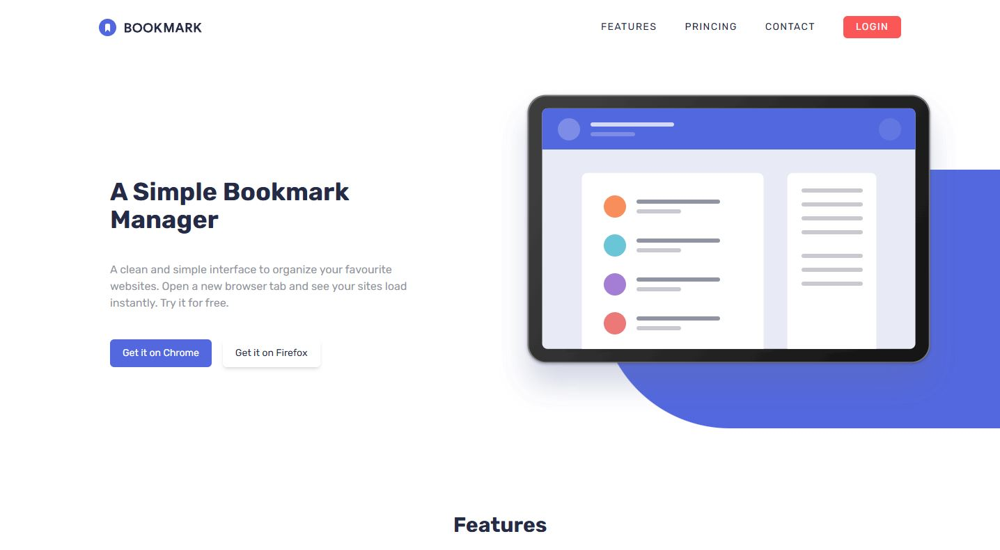

# Bookmark Landing Page

Solution for a challenge by <a href="https://www.frontendmentor.io/home">Frontendmentor.io</a>

## Built with

HTML | TailwindCSS | JavaScript

## Overview

I made this Bookmark Landing Page as a challenge by frontend mentor using HTML for layout, TailwindCSS for styling and JavaScript for functionality. The Page is responsive for mobiles and desktop screens.
